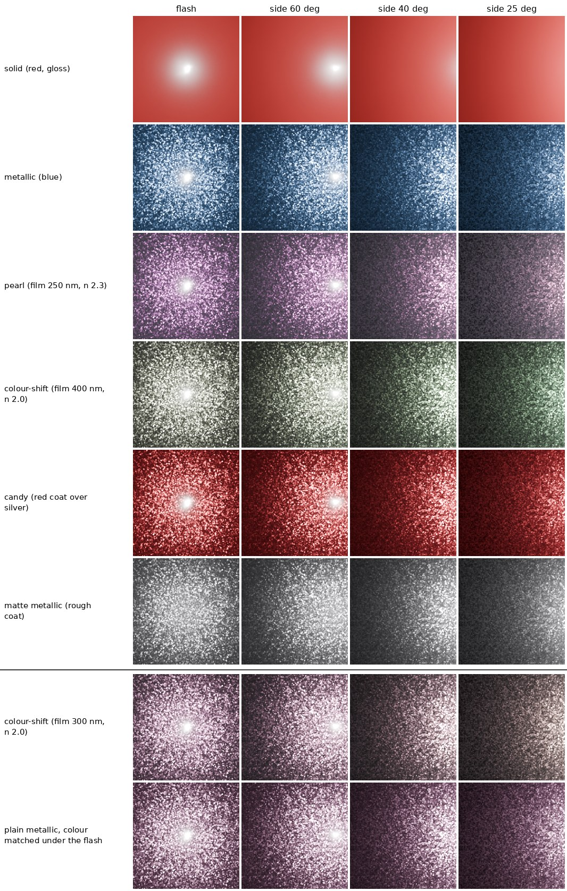

# v2 — every kind of car paint, from a few photos

v1 (Runs 1–9 in `ablations.md`) estimates a metallic paint's layers from one
flash photo. v2 extends the same pipeline to **solid, metallic, pearlescent,
colour-shift and candy paint, in gloss or matte**, by changing what is
photographed, not by starting over. Sources for every claim below are in
`reading_notes_v2.md`.



*Rows: one paint of each type, then a colour-shift paint and a plain metallic
paint tuned to look the same under the flash. Columns: the phone's flash, then
a light 60°, 40° and 25° above the surface. Rendered with
`data/blender_gen/paint_gallery.py`.*

---

## 1. Why the capture has to change

Pearlescent and colour-shift paints get their colour from **thin-film
interference**: light bouncing off the top and bottom of a coating ~100–700 nm
thick. Which wavelengths survive depends on the angle at which light meets
the flake.

A phone's flash sits about 1 cm from its lens. Light and camera point the same
way, so every flake that reflects the flash into the lens is lit head-on
(θd ≈ 0 for every pixel). A flash photo therefore shows one colour per paint —
its "face" colour — and never how that colour **changes** with angle.
Moving the phone doesn't help, because the flash moves with it. v4's sideways
light only reached θd ≈ 20° at most (about 10° typically).

The bottom two rows of the figure make this concrete. The plain metallic paint
was tuned until its flash photo had the same average colour as the colour-shift
paint's (largest difference 0.002 per channel, linear RGB). From the side
they separate: at 25° the colour-shift paint has turned brown-neutral while
the metallic paint stays mauve (difference 0.019, about ten times larger, on
an image a third as bright). No network can tell them apart from the first
column alone. The numbers are in `gallery.json`, written by the same script.

Paint metrology agrees: ASTM E2539 says interference pigments "require
measurement at multiple angles of illumination and detection", and BYK-mac
instruments read colour at six angles.

The same argument probably explains v1's two unlearned parameters
(`coat_weight`, `peel_strength`, ~0% skill in every run): in a dark room the
coat reflects only the flash, confined to one central highlight. A side light
moves the coat's reflection away from the base's.

## 2. What changes, what stays

| | v1 (Runs 1–9) | v2 |
|---|---|---|
| Paint types | metallic only | solid, metallic, pearl, colour-shift, candy × gloss/matte |
| Photos per sample | 1 (flash) | 1 flash + 5 side-lit, same camera |
| Shader | Principled BSDF: base, flakes, coat, peel | + Coat Tint (candy), + Thin Film (pearl, colour-shift), wider coat roughness (matte) |
| Layer parameters | 5 | 10: coat weight, roughness, tint RGB; flake size, strength; peel; film thickness, film IOR |
| Network | `CarPaintNet` | `MultiLightPaintNet`: the same trunk run on each photo, max+mean pooled, plus a pigment-type head |
| Loss | L1 maps + L1 scalars | + masked scalars (ignore meaningless ones) + pigment cross-entropy |
| Evaluation | skill per parameter | skill per parameter **per photo set** and **per paint type** |
| Data | `generate_dataset_v3/v4.py` | `generate_dataset_v5.py` |

Unchanged: the ground-truth maps and their encodings, the analytic flakes,
the skill metric, held-out test sets, the guard rails (meta.json range checks,
run-folder overwrite guard), and the three.js demo.

Backward compatible:
- v5's flash photo keeps the name `photo_XXXXXX.png`, so v1's `train.py`
  can train on v5's flash photos unchanged.
- `MultiLightDataset` reads v3/v4 folders as one photo per sample.
- v1 checkpoints still load into `CarPaintNet`, and can initialise the v2
  trunk (`--init-from`).

## 3. Recipe check (done 2026-10-07, before any large render)

Rendered with `paint_gallery.py` and three thickness/IOR sweeps:

- **Thin film on a pale, mostly non-metallic base is nearly invisible.** The
  film only changes the base's specular, which is weak next to a light diffuse
  colour. Pearl therefore uses a part-metallic (0.4–0.8), mid-dark base.
- **A low-index film (n ≈ 1.45) on metal is almost colourless in Blender.**
  Colour-shift film IOR starts at 1.5.
- **The clear coat does not cancel the film.** Coat on and coat off gave the
  same colours, which ruled out an earlier worry: the film sits under a coat
  of similar IOR, and I had expected that to cancel the interference.
- Candy reads as intended. The base-colour map is silver; the red lives in
  `coat_tint_*`.
- Matte (coat roughness 0.35–0.70) removes the sharp coat highlight, as it
  should.
- The banding rings visible on flat solid paint (in a full-size render) are ordinary 8-bit
  quantisation of a smooth gradient: one code value every few pixels, and
  the same in v1–v4.

### Pipeline checks (done 2026-10-07, on a 40-sample, 128 px test render)

- **Brightness fix (2026-10-08, after the checks below).** The trunk's
  InstanceNorm made every photo brightness-blind, so the network could not
  compare the flash photo with the side-lit ones. `MultiLightPaintNet` now
  uses `prenorm_global` (see `ablations.md`, Audit 3). Any 40-sample test
  folder rendered before the v5 dither fix must be re-rendered into a new
  folder; the generator refuses to resume it.

- **Data.** `dataset_multi.py` self-test passes; every photo is pixel-aligned
  with its maps; masks follow the rules; the v1 loader also reads v5 folders.
- **Overfit test caught a bug.** The first `MultiLightPaintNet` put an
  InstanceNorm block after pooling. InstanceNorm removes each image's own
  per-channel mean, and most of a paint's map *is* that mean. On the same
  4 samples and 150 steps, v1's network reached map loss 0.017, the new one
  0.16 — worse than predicting the average. With the norm removed (plain convs,
  residual on the pooled features, global vector added back) it reaches
  0.013 on one photo, and keeps falling with random photo subsets.
- **Independent review** (a separate reviewer, re-running the code) confirmed:
  seeds reproduce paints and lights exactly; ranges and masks hold over 20,000
  draws; train/val/test never overlap; the masked loss, pigment loss, AMP and
  the skill/confusion maths are right (a mean predictor scores exactly 0%); the
  side-light energy formula matches the flash at the sample centre to 0.6%.
  It also found problems, all fixed:
  - training saw at most 4 photos while validation used 6. `--max-photos` now
    defaults to all photos, and evaluation never shows more than the run
    trained with;
  - a wrong working directory in the Phase 2 commands below;
  - the resume guard now compares every generation setting;
  - `--init-from` now fails loudly on a non-matching checkpoint;
  - plus smaller fixes in the evaluation and loader.

## 4. Experiments, with predictions written down first

All on a held-out test set (`dataset_v5_test`, seeds from 100000).

| # | Run | Command difference | Question |
|---|---|---|---|
| 10 | **v5 single-flash baseline** | `train_multi.py --photos flash` | What can one flash photo do on every paint type? |
| 11 | **v5 multi-light** | `train_multi.py` (random 1–6 photos) | The main model |
| 12 | v5 multi-light, flash always included | `--photos flash+random` | Was Run 11 held back by training without the flash photo? (added after Runs 10–11) |
| 13 | v5 multi-light, v1 init | `--init-from runs/v4_long/best.pt` | Does v1's training transfer? |
| 14 | v1 code on v5 flash photos (optional) | `train.py --root dataset_v5 --epochs 150 --schedule cosine` | Sanity check against Run 10 |

Runs 13 and 14 were numbered 12 and 13 until 2026-10-09, when Run 12 was
added; neither had been run.

Run 14 is only roughly comparable with Run 10. v1's loader has no masks, so
for solid paint `flake_scale` is a random target there. Compare coat
roughness, flake strength, coat weight and peel only, and expect small
differences from batch size (v1 8, v2 4) and the extra heads.

`eval_multi.py` scores Run 11 shown different photo sets (flash / side1 /
flash+side1 / flash+3 sides / all). Predictions, from the physics above:

| parameter | flash only | with side lights |
|---|---|---|
| film_ior | ~0% | clearly > 0 |
| film_thickness | partial (face colour is a clue) | higher |
| coat_weight | ~0% (as in v1) | > 0 |
| peel_strength | ~0% | small gain at most (still no environment to reflect) |
| flake size / strength, coat roughness | as v1 (70–90%) | similar or slightly higher |

**Outcome (2026-10-09):** Runs 10–11 in `ablations.md` (Findings 12–15). Most
of these predictions failed, and the multi-light model did not beat the
flash-only one; Run 12 tests the first explanation.
| pigment: pearl/colour-shift vs metallic confusions | frequent | rare |

If film_ior stays at ~0% even with side lights, the likely reasons are its
trade-off with thickness (Kitagawa 2013) and the small Blender colour shifts
seen in §3. Report it either way: a parameter that physics says needs angles,
measured failing without them and (hopefully) working with them, is the
result.

## 5. What to run, in order

Commands assume PowerShell in the repo root with the venv active, and Blender
5.1 at the usual path (adjust if yours differs). `&` runs a quoted .exe.

### Phase 0 — finish v1 (an evening)
1. Unzip `1_v1_wrapup.zip` over the repo, then commit (see the instructions
   that came with it).
2. Held-out test sets for v1, if not done yet:
   ```
   cd data\blender_gen
   & "C:\Program Files\Blender Foundation\Blender 5.1\blender.exe" -b -P generate_dataset_v3.py -- --start 2000 --count 300 --out dataset_v3_test
   & "C:\Program Files\Blender Foundation\Blender 5.1\blender.exe" -b -P generate_dataset_v4.py -- --start 2000 --count 300 --out dataset_v4_test --reuse-maps dataset_v3_test
   cd ..\..
   python src/eval_baseline.py --root data/blender_gen/dataset_v4 --test-root data/blender_gen/dataset_v4_test --ckpt runs/v4_long/best.pt >> heldout.txt
   ```
   (and the same for the other checkpoints you want in the table).
3. Re-export the demo from `runs/v4_long`, commit, then tag the release:
   `git tag v1.0` and `git push origin v1.0`. Recruiters can always see v1
   exactly as it was.

### Phase 1 — check the recipes (30 min)
```
cd data\blender_gen
& "C:\Program Files\Blender Foundation\Blender 5.1\blender.exe" -b -P paint_gallery.py -- --out gallery
& "C:\Program Files\Blender Foundation\Blender 5.1\blender.exe" -b -P generate_dataset_v5.py -- --count 4 --out dataset_v5
cd ..\..
python src/data/dataset_multi.py --root data/blender_gen/dataset_v5
```
Open `data\blender_gen\gallery\gallery.png` and the 4 samples. The last
command must end with `RESULT: dataset looks correct.`

### Phase 2 — render (overnight)
```
cd data\blender_gen
& "...blender.exe" -b -P generate_dataset_v5.py -- --count 4000 --out dataset_v5
& "...blender.exe" -b -P generate_dataset_v5.py -- --start 100000 --count 400 --out dataset_v5_test
cd ..\..
```
Use the same `--out dataset_v5` as Phase 1: it continues after the 4 samples
already there (and refuses if any setting changed).
About 1 MB per sample (~4.5 GB total). The script prints its own time
estimate after the first sample. It resumes where it stopped if interrupted.

### Phase 3 — train
```
python src/train_multi.py --root data/blender_gen/dataset_v5 --out runs/v5_overfit --overfit 4 --epochs 200 --schedule constant
python src/train_multi.py --root data/blender_gen/dataset_v5 --out runs/v5_flash --photos flash
python src/train_multi.py --root data/blender_gen/dataset_v5 --out runs/v5_multi
```
The overfit run's loss should keep falling towards 0 (on a 128 px test set,
map loss reached 0.013 after 150 steps with the flash photo alone). Use `--schedule constant` for it - the default
cosine schedule shrinks the learning rate too fast to judge.

Defaults: 4 samples per batch, each with 1–6 of its photos (all six
available), so up to 24 images per step, about 3× v1's memory. Out of GPU
memory → `--batch-size 2` (not `--amp`: Run 12's first attempt with it
turned to NaN in epoch 2, see `ablations.md`). Expect roughly 2–3× v1's
time per epoch.

### Phase 4 — evaluate
```
python src/eval_multi.py --run runs/v5_multi --test-root data/blender_gen/dataset_v5_test --json runs/v5_multi/test.json
python src/eval_multi.py --run runs/v5_flash --test-root data/blender_gen/dataset_v5_test --json runs/v5_flash/test.json
```
Record both tables in `ablations.md` as Runs 10–11, next to the predictions
in §4.

### Phase 5 — real paint (a weekend)
See §6. Needs one more script, `relight_eval.py` (to be written): build a
Blender material from the network's prediction, render it under the held-out
light, and compare with the real photo.

### Phase 6 — demo
A second page, `demo/v2.html` (code in `demo/v2.js`), shows a v2 run: a
sphere with the predicted or true material, a light you can move, the
sample's flash and side photos, all 10 layer parameters predicted vs. true,
and the predicted paint type with its probabilities. Its assets come from
`src/export_demo_multi.py`, which runs a `train_multi.py` run on 12 samples
spread over the five paint types:
```
python src/export_demo_multi.py --run runs/v5_multi --test-root data/blender_gen/dataset_v5_test
cd demo
python -m http.server 8000
```
then open http://localhost:8000/v2.html. Without `--test-root` it exports
from the run's validation split (the samples `eval_multi.py` scores without
`--test-root`). The network is shown the photos the run trained on: the flash
photo alone for `--photos flash`, otherwise the flash photo and side photos
up to `--max-photos`. Output goes to `demo/assets/samples_v2/`, which is
replaced on every export; the script refuses to delete a folder it did not
write (including v1's `demo/assets/samples/`). Without exported samples the
page says so and shows the command. The page says that none of the samples
was used for training only when the script could check it: with
`--test-root` it warns, as `eval_multi.py` does, when test indices also exist
in the training folder (same index = same paint), and an `--overfit` run,
which validates on its training samples, is exported labelled as such.

`index.html` does not link to `v2.html` yet: GitHub Pages would publish the
link before any samples exist. Commit `demo/assets/samples_v2/` first, then
add the link.

How the sphere maps the parameters, and what is approximated:
- **Base, flakes, clear coat:** as in v1 (base colour, roughness, metallic and
  flake-normal textures; `clearcoat` = coat weight, `clearcoatRoughness` =
  coat roughness).
- **Thin film:** `iridescence` = 1, `iridescenceIOR` = film IOR,
  `iridescenceThicknessRange` = [d, d] with d the film thickness in nm; 0
  when the paint has no film. A *predicted* film thinner than 50 nm counts
  as no film (the network can't output exactly 0; the thinnest real film in
  v5 is 100 nm). Approximate: three.js works out the film's colour from the
  viewing angle alone (Blender from the angle between light and viewer, via
  the half-vector; the two agree in a sharp highlight on the sphere). Both
  put air (IOR 1) outside the film, under the coat too. Colours are close,
  not exact.
- **Candy coat tint:** three.js has no clear-coat tint, so the base colour is
  multiplied by 1 − w + w·tint (w = coat weight). That is Blender's own rule
  at normal incidence: its Coat Tint is the colour left after the trip in and
  out of the coat (applied once, not squared), and Coat Weight blends it in
  (Cycles' `bsdf_coat_setup`). Blender also deepens the tint where the *view*
  grazes the coat, up to tint^1.34 at the sphere's rim (coat IOR 1.5); the
  page doesn't show that.
- **Not drawn:** orange peel (one number, no map), and flake *size* (the
  "Flake size on object" slider sets it, as in v1).
- **Lighting:** one directional light, placed relative to the view and
  measured like v5's lights (`lights` in `params_*.json`, camera looking
  straight at the swatch): elevation 5–90° above the surface facing the
  camera, 90° = at the camera (the flash; the side lights are 20–65°), and
  azimuth 0–355° round the view, 0° = from the right of the photo, 90° = from
  the top. The middle of the sphere faces the camera as the swatch did, so it
  sees a side photo's light at that photo's angles. Plus an optional dim
  `RoomEnvironment`. "Light only" is closest to the dark-room training
  photos. AgX tone mapping, as in the v5 photos.

Still to do: glTF export via `KHR_materials_iridescence`.

### Phase 7 — extension: device finishes
A second generator branch for anodized/sandblasted aluminium, frosted glass
and iridescent glass backs, reusing the v5 shader and model (see
`reading_notes_v2.md` §7).

## 6. Real-paint capture protocol (for Phase 5)

**Swatches.** Nail polish and model-kit paints come in every finish: solid,
matte top coat, metallic, pearl, candy (clear colour over silver) and
"chameleon". Paint each on a flat card or plastic spoon. 3–4 of each type is
about 20 swatches. Name them descriptively ("deep red pearl"), not by product
name.

**Setup.** A dark room. The phone on a stand, 25–30 cm above the swatch and
pointing straight down. Lock focus and exposure if the camera app allows.

**Photos per swatch.**
1. Flash on.
2. Flash off; a second phone's torch held about 30 cm from the swatch, at 4–5
   different directions around it and different heights (low and grazing to
   high).

Don't move the phone between shots; the photos must line up. Note roughly
where each torch position was.

**Score without ground truth.** Hold out one torch photo. Predict from the
rest. Render the prediction under that light and compare with the real photo
(L1, LPIPS, ΔE00 of the mean colour). Do this per swatch and per paint type.

## 7. Known limitations and risks

- **One film per sample.** Real pearl pigments have a spread of thicknesses
  (Guo et al. 2018, Guillén et al. 2020). Colour-shift pigments are
  multi-layer stacks; one film over metal is a stand-in.
- **Film thickness repeats.** Interference colours cycle as thickness grows,
  and thickness trades off against IOR. The ranges are kept short for that
  reason; film_ior may stay hard.
- **Uncalibrated lights.** The network isn't told where the side light was.
  This is realistic for a hand-held torch but harder to learn. Feeding an
  approximate direction is a possible later ablation.
- **Camera square to the sample.** v5 does not tilt the camera; a real
  stand-mounted phone is close to square, but not exact.
- **Rendering loss off.** `render.py` has no coat, flakes or film, so it
  cannot score v5 paints. The relighting metric (Phase 5) replaces it for
  evaluation.
- **Peel isn't masked for matte paint.** On a rough coat, orange peel is
  probably invisible, so about a fifth of its targets may be unlearnable. It
  was already ~0% in v1. Kept, because it measures observability rather than
  meaning; the per-pigment table will show it.
- **Max-pooling grows with the photo count.** One trained model covers 1 to 6
  photos because training mixes them, but it hasn't seen more than 6.
- **Synthetic only until Phase 5.** Everything before that measures how well
  the network inverts Blender, not real paint.

## 8. Files added for v2

| file | what it does |
|---|---|
| `data/blender_gen/generate_dataset_v5.py` | paint types + flash/side-lit photos + maps |
| `data/blender_gen/paint_gallery.py` | recipe check and the figure above |
| `src/data/dataset_multi.py` | loads K photos per sample, scalar masks, pigment labels |
| `src/models/model.py` | + `MultiLightPaintNet` (v1's `CarPaintNet` unchanged; v1 checkpoints still load) |
| `src/train_multi.py` | training with random photo subsets, masked loss, pigment head |
| `src/eval_multi.py` | skill by photo set and paint type, pigment confusions |
| `docs/reading_notes_v2.md` | sources |
